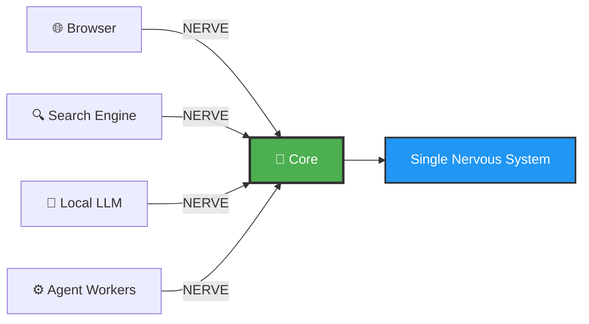

<div align="center">

# 🔮 Anvesha Systems

[](https://github.com/anvesha-systems)
[](https://github.com/anvesha-systems)
[](https://github.com/anvesha-systems)
[](https://github.com/anvesha-systems)

**Local-first AI systems. Ultra-low-latency infrastructure. Privacy by design.**

---

</div>

## 🌟 Overview

Anvesha Systems builds **on-device intelligence infrastructure** where search, AI models, and agentic tasks run entirely on the user's machine. We focus on systems-level correctness: custom protocols, deterministic execution, and explicit control over data and computation.

> 💡 **Core Philosophy:** If it can't work offline, it doesn't ship.

---

## ❓ Why Anvesha Systems Exists

<table>
<tr>
<td width="50%">

### 🚫 What We Reject

Modern AI systems assume that:
- 📤 Data must leave the device
- ☁️ Intelligence must live in the cloud
- 🎭 Agents can operate opaquely
- 🤝 Users should trade privacy for convenience

</td>
<td width="50%">

### ✨ What We Believe

These assumptions are **fundamentally flawed**.

We build **local, inspectable, and controllable intelligence**, enforced by architecture — not by policy or promises.

</td>
</tr>
</table>

---

## 🚀 What We Are Building

### 🔗 NERVE — Local AI Communication Core

<div align="center">



</div>

A **binary, ultra-low-latency IPC protocol** that connects local components as if they were part of a single nervous system.

#### 🎯 Key Properties
- 🔌 **Unix domain sockets** (local-only)
- 📡 **Streaming-first semantics** (tokens, events)
- ⏹️ **Immediate cancellation**
- 🎲 **Deterministic performance**
- 🔴 **Zero network dependency**

---

### 🧠 Local AI Execution

<div align="center">

| Feature | Description |
|:-------:|:------------|
| 🖥️ **On-Device** | AI runs on your machine, not remote servers |
| 🌊 **Streaming** | Token-level streaming for real-time responses |
| ⚡ **Hard Limits** | Execution limits and resource controls |
| 🛑 **Kill Switches** | Cooperative cancellation on demand |
| 🔐 **Zero Telemetry** | No silent uploads, no tracking |

</div>

> 🔒 **Your data never leaves your machine — by design.**

---

### 🤖 Agentic Task Infrastructure

We are building primitives for **controlled agentic systems**:

```
┌─────────────────────────────────────┐
│   🚀 START → 🌊 STREAM → ✅ DONE   │
│                                     │
│   • Observable execution            │
│   • Deterministic behavior          │
│   • Immediate cancellation          │
└─────────────────────────────────────┘
```

> 🛠️ **Agents should be tools — not autonomous black boxes.**

---

## ✅ What We've Achieved So Far

<div align="center">

### 🏗️ Core Infrastructure (Stable)


</div>

| Component | Status | Description |
|-----------|:------:|-------------|
| NERVE Core Protocol v0.1 | ✅ | Binary frame-based IPC with streaming |
| SEARCH Worker Routing | ✅ | End-to-end tested routing |
| AI Worker Routing | ✅ | Skeleton implementation ready |
| Cooperative CANCEL | ✅ | Proper cancellation semantics |
| Unix Socket Tests | ✅ | Real integration tests |
| Connection Lifecycle | ✅ | Clean ownership model |
| Agent Task Scaffolding | ✅ | Lifecycle management framework |

<div align="center">

**🎉 This foundation is stable and production-grade.**

</div>

---

## 🛠️ Key Repositories

<table>
<tr>
<td width="33%">

### 🔥 nerve-core
**Core IPC Engine**

Core IPC engine, routing, cancellation, and streaming semantics

[](https://github.com/anvesha-systems)

</td>
<td width="33%">

### 📡 nerve-protocol
**Protocol Definitions**

Protocol definitions, framing, message types, and limits

[](https://github.com/anvesha-systems)

</td>
<td width="33%">

### 🧠 nerve-ai-worker
**AI Worker**

Local AI worker for streaming LLM inference via NERVE

[](https://github.com/anvesha-systems)

</td>
</tr>
</table>

---

## 🔜 What's On the Way

<div align="center">

### 📅 Roadmap

</div>

<table>
<tr>
<td width="33%">

#### 🎯 Near Term
- 🔜 WebLLM / local LLM integration
- 🔜 Real token streaming through NERVE
- 🔜 AI firewall (hard limits, kill switches)
- 🔜 Offline demo (network disabled)

</td>
<td width="33%">

#### 🚀 Medium Term
- 🔜 Agentic task execution (non-stub)
- 🔜 Search → AI pipelines
- 🔜 Browser-side integration
- 🔜 Better observability for agent workflows

</td>
<td width="33%">

#### 🌟 Long Term
- 🔜 Fully local AI browser workflows
- 🔜 Privacy-first automation
- 🔜 Composable local intelligence services

</td>
</tr>
</table>

---

## 🧩 Core Principles

<div align="center">

| Principle | Description |
|:---------:|:------------|
| 🏠 **Local-first** | Offline by default |
| 🔒 **Privacy by architecture** | Not policy |
| ⚡ **Low-latency by design** | Systems-level optimization |
| 🎮 **Explicit control** | User-driven cancellation |
| 🏗️ **Systems correctness** | Over hype |

</div>

---

## 👥 Who We Are

<div align="center">

```
┌───────────────────────────────────────────────┐
│                                               │
│   We are engineers focused on:                │
│                                               │
│   ⚙️  Systems programming                     │
│   ⚡  Low-latency infrastructure              │
│   🔐  Security-aware design                   │
│   🎯  Long-term reliability                   │
│                                               │
│   We build foundations first, products second │
│                                               │
└───────────────────────────────────────────────┘
```

</div>

---

## 📌 Status

<div align="center">


**Active development.**  
**Core infrastructure is stable.**  
**Product layers are evolving.**

</div>

---

## 📫 Collaboration

<div align="center">

### 🤝 We Welcome Engineers Aligned With:

|  |  |
|:---:|:---:|
| ✨ **Clarity** | 🎯 **Correctness** |
| 🧠 **Long-term thinking** | 🔧 **Systems focus** |

This organization focuses on **systems and infrastructure**.  
Collaboration is welcome with those who share our values.

</div>

---

<div align="center">

## 💫 In One Line

### *Anvesha Systems builds local, controllable intelligence — because AI should serve users, not observe them.*

---

<sub>Made with 💚 by engineers who care about privacy, performance, and user control</sub>

</div>
