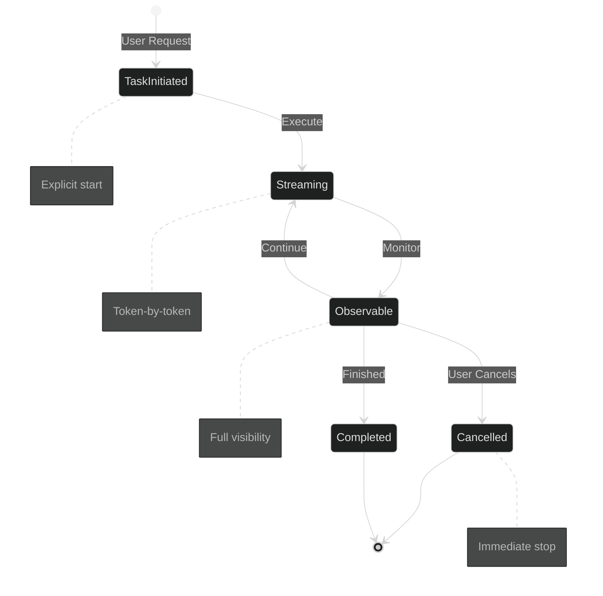

╔══════════════════════════════════════════════════════════════════════════════╗
║                                                                              ║
║      █████╗ ███╗   ██╗██╗   ██╗███████╗███████╗██╗  ██╗ █████╗             ║
║     ██╔══██╗████╗  ██║██║   ██║██╔════╝██╔════╝██║  ██║██╔══██╗            ║
║     ███████║██╔██╗ ██║██║   ██║█████╗  ███████╗███████║███████║            ║
║     ██╔══██║██║╚██╗██║╚██╗ ██╔╝██╔══╝  ╚════██║██╔══██║██╔══██║            ║
║     ██║  ██║██║ ╚████║ ╚████╔╝ ███████╗███████║██║  ██║██║  ██║            ║
║     ╚═╝  ╚═╝╚═╝  ╚═══╝  ╚═══╝  ╚══════╝╚══════╝╚═╝  ╚═╝╚═╝  ╚═╝            ║
║                                                                              ║
║               ⚡ Local-first AI • Ultra-low-latency • Privacy by design ⚡    ║
║                                                                              ║
╚══════════════════════════════════════════════════════════════════════════════╝

<div align="center">

### 🎯 **On-device intelligence infrastructure** where search, AI models, and agentic tasks run entirely on the user's machine. 

```ascii
┌─────────────────────────────────────────────────────────────┐
│  We focus on:  custom protocols • deterministic execution    │
│               explicit control • systems-level correctness   │
└─────────────────────────────────────────────────────────────┘
```

> ### ⚠️ **CORE RULE:** *If it can't work offline, it doesn't ship.*

</div>

---

<br>

## 🔴 **THE PROBLEM WITH MODERN AI**

<div align="center">

```diff
Modern AI systems make dangerous assumptions:
```

</div>

<table>
<tr>
<td width="25%" align="center">


**☁️ CLOUD DEPENDENCY**

Data must leave your device

</td>
<td width="25%" align="center">


**🔒 OPAQUE AGENTS**

Black box operations

</td>
<td width="25%" align="center">


**👁️ SURVEILLANCE**

Constant data collection

</td>
<td width="25%" align="center">


**💔 FALSE TRADE-OFF**

Privacy vs Convenience

</td>
</tr>
</table>

<br>

<div align="center">

### 🟢 **WE REJECT THESE ASSUMPTIONS**

```
┏━━━━━━━━━━━━━━━━━━━━━━━━━━━━━━━━━━━━━━━━━━━━━━━━━━━━━━━━━┓
┃  Anvesha Systems builds local, inspectable, and         ┃
┃  controllable intelligence — enforced by architecture,   ┃
┃  not by policy or promises.                              ┃
┗━━━━━━━━━━━━━━━━━━━━━━━━━━━━━━━━━━━━━━━━━━━━━━━━━━━━━━━━━┛
```

</div>

<br>

---

<br>

<div align="center">

## 🚀 **THE ANVESHA SYSTEMS STACK**

</div>

<br>

### `[1]` 🔗 **NERVE — The Local AI Communication Core**

<div align="center">

```
    ┌─────────────┐         ┌─────────────┐         ┌─────────────┐         ┌─────────────┐
    │   BROWSER   │◄───────►│   SEARCH    │◄───────►│  LOCAL LLM  │◄───────►│   AGENTS    │
    │      🌐     │   IPC   │   ENGINE    │   IPC   │     🧠      │   IPC   │     🤖      │
    └─────────────┘         └─────────────┘         └─────────────┘         └─────────────┘
           │                       │                        │                       │
           └───────────────────────┴────────────────────────┴───────────────────────┘
                                          │
                                    ╔═══════════╗
                                    ║   NERVE   ║  ← Binary, ultra-low-latency IPC
                                    ╚═══════════╝     Unix Domain Sockets
```

</div>

<br>

<details open>
<summary><b>⚙️ Technical Specifications</b></summary>

<br>

| Property | Implementation | Why It Matters |
|:---------|:---------------|:---------------|
| 🔌 **Transport** | Unix domain sockets | `Local-only, no network exposure` |
| 🌊 **Architecture** | Streaming-first | `Real-time tokens & events` |
| ⚡ **Cancellation** | Immediate & cooperative | `Stop execution instantly` |
| 🎯 **Performance** | Deterministic | `Predictable latency` |
| 🚫 **Dependencies** | Zero network | `100% offline capable` |

</details>

<br>

### `[2]` 🧠 **LOCAL AI EXECUTION LAYER**

<br>

<div align="center">

| ✅ **What Happens** | ❌ **What Doesn't Happen** |
|:-------------------|:---------------------------|
| 💻 Local LLM inference on your device | ☁️ ~~Remote server processing~~ |
| 🌊 Real-time token streaming | 📤 ~~Data uploads~~ |
| ⏱️ Hard execution limits | 📊 ~~Usage telemetry~~ |
| 🛑 Kill switches & cancellation | 🕵️ ~~Silent monitoring~~ |

</div>

<br>

<div align="center">

```
╔════════════════════════════════════════════════════════════╗
║  🛡️  YOUR DATA NEVER LEAVES YOUR MACHINE — BY DESIGN  🛡️  ║
╚════════════════════════════════════════════════════════════╝
```

</div>

<br>

### `[3]` 🤖 **AGENTIC TASK INFRASTRUCTURE**

<br>

> **Philosophy:** *Agents should be tools — not autonomous black boxes.*

<br>

<div align="center">



</div>

<br>

**Control Primitives:**

```rust
// Explicit task lifecycle
start()  →  stream()  →  observe()  →  done() | cancel()
  ↓           ↓            ↓              ↓
✅ Clear   ✅ Real-time  ✅ Visible   ✅ Controlled
```

<br>

---

<br>

<div align="center">

## ✅ **WHAT'S BUILT & TESTED**

```
████████████████████████████████████████ 100% Core Infrastructure STABLE
```

</div>

<br>

<table>
<tr>
<td width="33%" valign="top">

#### 🟢 **PROTOCOL LAYER**

- ✅ NERVE core v0.1
- ✅ Binary frame-based IPC
- ✅ Streaming semantics
- ✅ Cooperative CANCEL
- ✅ Unix socket integration

</td>
<td width="33%" valign="top">

#### 🟢 **WORKER SYSTEM**

- ✅ SEARCH routing (tested)
- ✅ AI worker skeleton
- ✅ Connection lifecycle
- ✅ Task scaffolding
- ✅ End-to-end validation

</td>
<td width="33%" valign="top">

#### 🟢 **RELIABILITY**

- ✅ Production-grade
- ✅ Memory safe
- ✅ Deterministic
- ��� Observable
- ✅ Documented

</td>
</tr>
</table>

<br>

<div align="center">

```
┏━━━━━━━━━━━━━━━━━━━━━━━━━━━━━━━━━━━━━━━━━━━━━━━━━━━━━┓
┃  This foundation is stable and production-grade.     ┃
┗━━━━━━━━━━━━━━━━━━━━━━━━━━━━━━━━━━━━━━━━━━━━━━━━━━━━━┛
```

</div>

<br>

---

<br>

<div align="center">

## 📦 **REPOSITORY ARCHITECTURE**

</div>

<br>

```
anvesha-systems/
│
├─ 🔧 nerve-core ─────────────┬─► Core IPC engine
│                              ├─► Routing & streaming
│                              └─► Cancellation semantics
│
├─ 📋 nerve-protocol ─────────┬─► Protocol definitions
│                              ├─► Frame specifications
│                              └─► Message types & limits
│
└─ 🤖 nerve-ai-worker ────────┬─► Local LLM worker
                               ├─► Token streaming via NERVE
                               └─► [🔶 IN PROGRESS]
```

<br>

---

<br>

<div align="center">

## 🗺️ **DEVELOPMENT ROADMAP**

</div>

<br>

```
TIMELINE
────────────────────────────────────────────────────────────────
```

<details>
<summary><b>📅 Q1 2026 — NEAR TERM</b></summary>

<br>

```diff
+ WebLLM / local LLM integration
+ Real token streaming through NERVE
+ AI firewall (hard limits, kill switches)
+ Offline demo (network disabled)
```

**Goal:** Fully functional local LLM inference with NERVE

</details>

<details>
<summary><b>📅 Q2-Q3 2026 — MEDIUM TERM</b></summary>

<br>

```diff
+ Agentic task execution (non-stub)
+ Search → AI pipelines
+ Browser-side integration
+ Better observability for agent workflows
```

**Goal:** Complete search-to-AI pipeline locally

</details>

<details>
<summary><b>📅 2027+ — LONG TERM</b></summary>

<br>

```diff
+ Fully local AI browser workflows
+ Privacy-first automation
+ Composable local intelligence services
```

**Goal:** Complete local-first AI ecosystem

</details>

<br>

---

<br>

<div align="center">

## 🧬 **DESIGN PRINCIPLES**

```
┌────────────┬────────────┬────────────┬────────────┬────────────┐
│  LOCAL     │  PRIVACY   │  LOW       │  EXPLICIT  │  SYSTEMS   │
│  FIRST     │  BY ARCH   │  LATENCY   │  CONTROL   │  CORRECT   │
├────────────┼────────────┼────────────┼────────────┼────────────┤
│  Offline   │  Not       │  By        │  Cancel    │  Over      │
│  by        │  policy    │  design    │  anytime   │  hype      │
│  default   │            │            │            │            │
└────────────┴────────────┴────────────┴────────────┴────────────┘
```

</div>

<br>

<table>
<tr>
<td align="center" width="20%">

### 🏠

**LOCAL-FIRST**

```
Device
  ↓
Data
  ↓
Control
```

No cloud required

</td>
<td align="center" width="20%">

### 🏗️

**ARCHITECTURE**

```
Design
  ↓
Enforce
  ↓
Verify
```

Not promises

</td>
<td align="center" width="20%">

### ⚡

**PERFORMANCE**

```
Binary
  ↓
Streaming
  ↓
Fast
```

Deterministic latency

</td>
<td align="center" width="20%">

### 🎛️

**CONTROL**

```
Start
  ↓
Observe
  ↓
Cancel
```

Always in your hands

</td>
<td align="center" width="20%">

### 🔬

**CORRECTNESS**

```
Prove
  ↓
Test
  ↓
Ship
```

Foundations matter

</td>
</tr>
</table>

<br>

---

<br>

<div align="center">

## 👥 **WHO BUILDS THIS**

</div>

<br>

<table>
<tr>
<td width="50%">

### 🛠️ **Our Focus**

```yaml
Engineering: 
  - Systems programming
  - Low-latency infrastructure
  - Security-aware design
  - Long-term reliability

Philosophy:
  - Foundations first
  - Products second
  - Users always
```

</td>
<td width="50%">

### 🤝 **Collaboration Welcome**

We work with engineers who value:

```javascript
const ideal_collaborator = {
  clarity: true,
  correctness: true,
  long_term_thinking: true,
  systems_mindset: true,
  user_sovereignty: true
};
```

</td>
</tr>
</table>

<br>

---

<br>

<div align="center">

## 📊 **CURRENT STATUS**

```
┏━━━━━━━━━━━━━━━━━━━━━━━━━━━━━━━━━━━━━━━━━━━━━━┓
┃  STATUS: ACTIVE DEVELOPMENT                  ┃
┃  ────────────────────────────────────────    ┃
┃  ✅ Core infrastructure: STABLE              ┃
┃  🔶 Product layers: EVOLVING                 ┃
┃  🚀 Shipping: INCREMENTAL                    ┃
┗━━━━━━━━━━━━━━━━━━━━━━━━━━━━━━━━━━━━━━━━━━━━━━┛
```

</div>

<br>

---

<br>

<div align="center">

```
╔══════════════════════════════════════════════════════════════════════════════╗
║                                                                              ║
║                         💬 IN ONE LINE                                       ║
║                                                                              ║
║     Anvesha Systems builds local, controllable intelligence —               ║
║     because AI should serve users, not observe them.                        ║
║                                                                              ║
╚══════════════════════════════════════════════════════════════════════════════╝
```

<br>

---

<br>

<sub>Built with 🔐 privacy • ⚡ performance • 💪 control</sub>

</div>